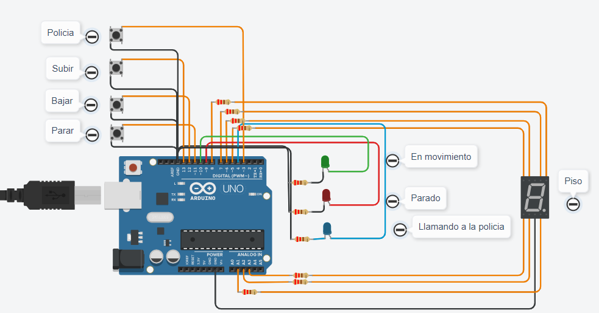

# Documentación Parcial


## Alumno
* Blanco Rivas Tomas

## Proyecto: Montacarga


## Descripción
Desarrollo de un modelo de montacarga para un hospital. El sistema puede subir, bajar o pararse en cada piso. Muestra el piso actual en el display de 7 segmentos.
1. El primer botón sube 1 piso.
    * Se enciende el led verde por 3 segundos
2. El segundo botón baja 1 piso.
    * Se enciende el led verde por 3 segundos
3. El tercer botón frena cualquier acción hasta que vuelva a ser presionado.
    * Se enciende el led rojo hasta volver a presionar el botón.
  
### Materiales
* 1 Arduino.

* 1 Display 7 segmentos.

* 2 Leds.

* 3 Botones

* Resistencias necesarias para cada componente.

## Entradas Digitales
```C++
pinMode(SUBIR, INPUT_PULLUP);
pinMode(BAJAR, INPUT_PULLUP);
pinMode(PARAR, INPUT_PULLUP);
```

## Salidas Digitales
```C++
pinMode(A, OUTPUT);
pinMode(B, OUTPUT);
pinMode(C, OUTPUT);
pinMode(D, OUTPUT);
pinMode(E, OUTPUT);
pinMode(F, OUTPUT);
pinMode(G, OUTPUT);
pinMode(LED_ROJO, OUTPUT);
pinMode(LED_VERDE, OUTPUT);
```

## Funciones

### Loop principal
Se encarga del funcionamiento integral del sistema.

Imprime por el monitor serial el piso en que se encuentra.

```C++
void loop()
{
  int presionar = PresionarBoton();
  PrenderSegmento(contador);
  
  if((presionar == SUBIR and contador < 9) 
     or (presionar == BAJAR and contador > 0))
  {
  	contador = MoverMontaCarga(presionar, contador);
  }
  if(presionar == PARAR)
  {
    PararMontaCarga(presionar);
  }
  Serial.println("Piso: " + String(contador));
}

```

### PrenderSegmento
La función se encarga de enceder el display 7 segmentos.

A, B, C, D, E, F, G son #define para agregar un segmento del display, asociados a pines de la placa de arduino.

numero recibe un contador que se utiliza para ingresar a las diferentes condiciones del switch.

Las secciones del display inician apagadas para que solo se prendan las necesarias en cada condición y se apaguen al salir.

```C++
void PrenderSegmento(int numero)
{
  digitalWrite(A, LOW);
  digitalWrite(B, LOW);
  digitalWrite(C, LOW);
  digitalWrite(D, LOW);
  digitalWrite(E, LOW);
  digitalWrite(F, LOW);
  digitalWrite(G, LOW);
  switch(numero)
  {
    case 0:
    {
      digitalWrite(A, HIGH);
      digitalWrite(B, HIGH);
      digitalWrite(C, HIGH);
      digitalWrite(D, HIGH);
      digitalWrite(E, HIGH);
      digitalWrite(F, HIGH);
      break;
    }
    case 1:
    {
      digitalWrite(B, HIGH);
      digitalWrite(C, HIGH);
      break;
    }
    case 2:
    {
      digitalWrite(A, HIGH);
      digitalWrite(B, HIGH);
      digitalWrite(D, HIGH);
      digitalWrite(E, HIGH);
      digitalWrite(G, HIGH);
      break;
    }
    case 3:
    {
      digitalWrite(A, HIGH);
      digitalWrite(B, HIGH);
      digitalWrite(C, HIGH);
      digitalWrite(D, HIGH);
      digitalWrite(G, HIGH);
      break;
    }
    case 4:
    {
      digitalWrite(B, HIGH);
      digitalWrite(C, HIGH);
      digitalWrite(F, HIGH);
      digitalWrite(G, HIGH);
      break;
    }
    case 5:
    {
      digitalWrite(A, HIGH);
      digitalWrite(C, HIGH);
      digitalWrite(D, HIGH);
      digitalWrite(F, HIGH);
      digitalWrite(G, HIGH);
      break;
    }
    case 6:
    {
      digitalWrite(A, HIGH);
      digitalWrite(C, HIGH);
      digitalWrite(D, HIGH);
      digitalWrite(E, HIGH);
      digitalWrite(F, HIGH);
      digitalWrite(G, HIGH);
      break;
    }
    case 7:
    {
      digitalWrite(A, HIGH);
      digitalWrite(B, HIGH);
      digitalWrite(C, HIGH);
      break;
    }
    case 8:
    {
      digitalWrite(A, HIGH);
      digitalWrite(B, HIGH);
      digitalWrite(C, HIGH);
      digitalWrite(D, HIGH);
      digitalWrite(E, HIGH);
      digitalWrite(F, HIGH);
      digitalWrite(G, HIGH);
      break;
    }
    case 9:
    {
      digitalWrite(A, HIGH);
      digitalWrite(B, HIGH);
      digitalWrite(C, HIGH);
      digitalWrite(D, HIGH);
      digitalWrite(F, HIGH);
      digitalWrite(G, HIGH);
      break;
    }
  }
}
```
### PresionarBoton
La función selecciona la acción activada por el usuario y evita repeticiones si se mantiene presionado el botón.

SUBIR, BAJAR y PARAR son #define para agregar un botón, asociados a pines de la placa de arduino.

subirAnterior, bajarAnterior y pararAnterior se refieren al estado en el que se encuentran desactivados los botones.

Si el estado actual es diferente al estado anterior, se retorna la variable correspondiente.

```C++
int PresionarBoton(void)
{
  subir = digitalRead(SUBIR);
  bajar = digitalRead(BAJAR);
  parar = digitalRead(PARAR);
  if(subir == 1) // No se presionó
  {
    subirAnterior = 1; //Antes no estaba presionada
  }
  if(bajar == 1)
  {
    bajarAnterior = 1;
  }
  if(parar == 1)
  {
    pararAnterior = 1;
  }
  
  if(subir == 0 and subir != subirAnterior) //0 presionado
  {
    subirAnterior = subir;
    return SUBIR;
  }
  if(bajar == 0 and bajar != bajarAnterior)
  {
    bajarAnterior = bajar;
    return BAJAR;
  }
  if(parar == 0 and parar != pararAnterior)
  {
    pararAnterior = parar;
    return PARAR;
  }
}
```

### MoverMontaCarga
La función se encarga de aumentar o reducir el contador en 1, según el parámetro recibido.

presionar recibe una variable que representa un pin de la placa de arduino.
contador recibe un contador que se utiliza para ingresar sumar o restarle 1.

Llama a la función CalcularTiempoMovimiento pasándole como parámetro el mensaje.

Retorna el contador.
```C++
int MoverMontaCarga(int presionar, int contador)
{
  const char* mensaje;
  int tiempoDelay = 3000;
  int tiempoRequerido = tiempoDelay;
  
  if(presionar == SUBIR)
  {
    contador++;
    mensaje = "SUBIENDO";
  }
  else
  {
    contador--;
    mensaje = "BAJANDO";
  }  
  CalcularTiempoMovimiento(mensaje);
  return contador;
}
```

### CalcularTiempoMovimiento
La función se encarga de calcular los milisegundos que tarda el movimiento del montacarga.

mensaje recibe una cadena de caracteres que refleja la acción del montacarga para imprimirse en el monitor serial

La función millis() calcula el tiempo que pasó desde que el sistema está encendido. 

Se ingresa a un bucle while mientras que el tiempoRequerido sea menor que los milisegundos transcurridos y
el tiempoInicio 

Se llama a la función PrenderApagarLed para controlar las luces. 

Se llama a la función PararMontaCarga para darle la posibilidad al usuario de detener el movimiento. 
En ese caso, el tiempoRequerido pasa a ser igual al tiempoRestante a llegar al lugar indicado y 
se actualiza el tiempoInicio. 
Sirve para que al salir del while, el montacarga siga con su movimiento.

Al finalizar el movimiento, se apaga el led verde.
```C++
void CalcularTiempoMovimiento(const char* mensaje)
{
  int tiempoDelay = 3000;
  int tiempoRequerido = tiempoDelay;
  unsigned long tiempoInicio = millis();
  
  while(millis() - tiempoInicio < tiempoRequerido)
  {
    int tiempoTranscurrido = millis() - tiempoInicio;
    int tiempoRestante = tiempoDelay - tiempoTranscurrido;
    PrenderApagarLed(LED_VERDE, LED_ROJO);
    int presionarSegundo = PresionarBoton();
    if (presionarSegundo == PARAR)
    {
      PararMontaCarga(presionarSegundo);
      tiempoInicio = millis();
      tiempoRequerido = tiempoRestante;
    }
    Serial.println(mensaje);
  }
  digitalWrite(LED_VERDE, LOW);
}
```
### PararMontaCarga
La función se encarga de detener el sistema.

presionar recibe una variable que representa un pin asociado a un botón de la placa de arduino.

presionarSegundo llama a la función PresionarBoton. 

Se llama a la función PrenderApagarLed para controlar las luces leds.

Se ingresa a un bucle que sólo terminará cuando presionarSegundo tenga el valor del pin asociado al botón PARAR.

```C++
void PararMontaCarga(int presionar)
{ 
  int presionarSegundo = PresionarBoton();
  while(presionar != presionarSegundo)
  {
    PrenderApagarLed(LED_ROJO, LED_VERDE);
    Serial.println("PARADA");
    presionarSegundo = PresionarBoton();
  }
  Serial.println("REANUDADO");
  digitalWrite(LED_ROJO, LOW);
}
```

### PrenderApagarLed
La función se encarga de encender y apagar las luces leds.

Recibe por parámetro dos enteros asociados a un pin de la placa de arduino.

Enciende el primer led y apaga el segundo.
```C++
void PrenderApagarLed(int ledPrender, int ledApagar)
{
  digitalWrite(ledPrender, HIGH);
  digitalWrite(ledApagar, LOW);
}
```
## Link al proyecto
* [Proyecto](https://www.tinkercad.com/things/cws0JsS7ioC)
